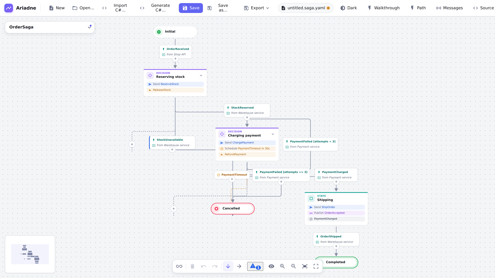

# Ariadne

**[Documentation and live demo](https://gravionlabs.github.io/ariadne/)** · [Try the editor](https://gravionlabs.github.io/ariadne/app/)

Diagrams for [MassTransit saga state machines](https://masstransit.massient.com/guides/saga-state-machines). Build a saga as a picture, keep it in git as a small YAML file, and read it side by side with the code.

Ariadne is a web app (Angular + [Foblex f-flow](https://github.com/Foblex/f-flow)) and a [VS Code extension](#vs-code-extension) that opens the same diagrams next to the code. Diagrams are plain local files, so they diff and review like code. It is **documentation only**: diagrams are never executed.

<picture>
  <source media="(prefers-color-scheme: dark)" srcset="docs/images/guide/hero-dark.png">
  
</picture>

## The model

A diagram is a saga **state machine**, the way MassTransit sagas are written:

| In the diagram                                                   | In MassTransit                                                     |
| ---------------------------------------------------------------- | ------------------------------------------------------------------ |
| **Initial state** (green) and **final state** (red, double ring) | `Initial` / `Final`                                                |
| **State** (card)                                                 | `State`                                                            |
| **Transition** (arrow)                                           | `During(State, When(Event).TransitionTo(Next))`                    |
| **Event** on a transition                                        | `Event<T>`: what moves the saga on                                 |
| **External event** (teal, with its source)                       | an event published by another service, e.g. `from Payment service` |
| **Activities** on a state: _Send_ a command, _Publish_ an event  | `WhenEnter(State, b => b.Send(..).Publish(..))`                    |
| **Decision** (violet): a state with several transitions          | several `When(...)` in one `During(...)`                           |
| **Compensation** on a state                                      | the undo action for the work done to reach it                      |

States do things; transitions react to events. A command is sent to exactly one consumer and named in the imperative (`ChargePayment`), an event is published to any number of subscribers and named in the past tense (`OrderAccepted`). The inspector hints at this when a name doesn't follow the convention. An event is **internal** when some state publishes it and **external** otherwise; Ariadne works that out from the diagram.

## What you can do

- **Build** a saga by clicking "+": after a state, or on a transition to insert a state into it. Dragging from a state's connector onto another state adds a transition. Nothing is placed by hand: the layout is automatic (top to bottom or left to right) and always tidy.
- **Look without the "+" buttons.** The eye button in the toolbar switches the view mode: the "+" buttons and the dotted lines to them are hidden, for reading or a screenshot. Everything else still edits; the choice is remembered.
- **Edit** the selection in the inspector: name, description, color, activities, compensation, retry and timeout for states; event, event source and kind for transitions.
- **Edit the source** next to the diagram: the **Source** button in the toolbar opens the YAML in a split view. Typing updates the diagram a moment later, editing the diagram updates the text, and a problem in the text is shown with its line and column while the diagram keeps its last valid state. Drag the divider to resize the panel.
- **Undo and redo** every edit (`Ctrl+Z`, `Ctrl+Shift+Z`).
- **Open and save** diagrams as `*.saga.yaml` files (`Ctrl+O`, `Ctrl+S`, `Ctrl+Shift+S`); older `.yaml` files still open. Where the browser allows it (Chrome, Edge) saving overwrites the opened file; otherwise it downloads a copy.
- **Switch the theme** with the toggle in the top bar: light, dark, or (until you choose) your system's setting. When Ariadne is embedded, the host can set it with `postMessage({ type: 'ariadne:theme', kind })`, `kind` being `light`, `dark`, `high-contrast` or `high-contrast-light`.
- **Use the keyboard.** `Tab` reaches the diagram once; then the arrows move between states and transitions (selecting them), `Ctrl`+arrow follows a transition, `Home`/`End` jump to the first or last state, `Ctrl+A` selects all, `Esc` clears, `Delete` removes the selection, `+`/`-`/`0` zoom. `Tab` on reaches the "+" buttons (`Enter` opens the picker), the inspector and the toolbar. Screen readers hear each state and transition and a live announcement of the selection; `prefers-reduced-motion` turns the animated fit and centring off.
- **Old files keep working.** Earlier file versions are migrated on open, and the app tells you what changed.

## Getting started

You need Node.js (see `.nvmrc`) and [pnpm](https://pnpm.io) (enabled with `corepack enable`). Ariadne uses pnpm only.

```sh
pnpm install
pnpm start        # dev server on http://localhost:4200
```

Then open `docs/examples/order.saga.yaml` with **Open…** to see the diagram above.

No Node or pnpm on the machine? Open the repository in the [dev container](.devcontainer/README.md): **Dev Containers: Reopen in Container** in VS Code, or **Code → Codespaces** on GitHub.

Other commands:

```sh
pnpm test            # unit tests (Vitest)
pnpm lint            # ESLint
pnpm format:check    # Prettier (pnpm format fixes)
pnpm build           # production build in apps/web/dist/
```

## VS Code extension

The extension opens `*.saga.yaml` files as diagrams in VS Code, with the same editor as the web app. The file stays a
normal text document, so save, undo, git diff and "Open with Text Editor" work as always.

- **Import** a state machine from C# (a CodeLens above the class), **generate** C# from a diagram, and see where a
  diagram and its code **drift** apart in the Problems panel, with quick fixes. **Go to code** jumps from a state or
  transition to its line in the C#.
- **Export** as SVG, PNG, Mermaid or Markdown, and draw a saga in the Markdown preview with a fenced ` ```saga ` block.
- **Edit the YAML** with a JSON Schema (completion and validation with the Red Hat YAML extension) and problems with
  line positions.

Every release carries the extension as `ariadne-vscode-<version>.vsix`: download it from the
[latest release](https://github.com/GravionLabs/ariadne/releases/latest) and run
`code --install-extension ariadne-vscode-<version>.vsix`. See [Ariadne in VS Code](docs/guide/vscode.md) and the
[extension's README](apps/vscode/README.md). To try it from source: `pnpm --filter ariadne-vscode dev`.

## Self-hosting

`docker run -p 8080:8080 ghcr.io/gravionlabs/ariadne:latest`, see [docs/self-hosting.md](docs/self-hosting.md). The [user guide](docs/guide/README.md) explains the editor, the C# import and generation, the exports and the VS Code extension. To show a saga in your own web or Angular app, see [the viewer](docs/guide/viewer.md) and its [README](packages/viewer/README.md) (demo pages included).

## Coding agents

An AI coding agent can check, draw, import, generate and compare sagas with the `ariadne` command, through the
[`ariadne` skill](skills/ariadne/SKILL.md):

- **GitHub Copilot** (and Cursor, Codex, Gemini CLI, …): `gh skill install GravionLabs/ariadne ariadne`
- **APM**, for any of them: `apm install GravionLabs/ariadne/skills/ariadne`
- **Claude Code**: `/plugin marketplace add GravionLabs/ariadne`, then `/plugin install ariadne@ariadne`

See [the guide](docs/guide/agents.md).

## Command line

The `ariadne` command (Node 22 or later) is attached to every [release](https://github.com/GravionLabs/ariadne/releases):

```sh
npm install -g https://github.com/GravionLabs/ariadne/releases/latest/download/ariadne-cli.tgz

ariadne lint docs/examples/*.saga.yaml      # exit 1 on errors
ariadne lint --max-warnings 0 --format json order.saga.yaml
ariadne export order.saga.yaml --format svg -o order.svg   # mermaid | svg | png | md
ariadne generate order.saga.yaml -o src/Orders    # diagram -> C#
ariadne import src/Orders/*.cs -o docs            # C# -> diagram
ariadne diff docs/order.saga.yaml src/Orders/*.cs   # exit 1 when they differ
```

From a clone: `pnpm --filter @ariadne/cli build`, then `node apps/cli/dist/ariadne.mjs …`. See [apps/cli/README.md](apps/cli/README.md).

`lint` reports the same findings as the editor's Problems list.

## Diagram files

A diagram is one YAML file, named `*.saga.yaml`. Only the graph is stored, no positions, so diffs show real changes to the saga:

```yaml
version: 3
direction: top-bottom
nodes:
  - { id: start-1, type: start, name: Initial }
  - id: state-1
    type: state
    name: Reserving stock
    activities:
      - command: ReserveStock
  - { id: end-1, type: end, name: Completed }
edges:
  - id: edge-1
    source: start-1
    target: state-1
    event: OrderReceived
    eventSource: Shop API
  - { id: edge-2, source: state-1, target: end-1, event: StockReserved }
```

The full format, with every field and the migration rules, is in [docs/specs/diagram-format.md](docs/specs/diagram-format.md). A complete example is [docs/examples/order.saga.yaml](docs/examples/order.saga.yaml).

## Project layout

```
apps/
  server/     Node server (Hono) that serves the built app, for the container
  cli/        the ariadne command: lint, export, generate, import, diff
  vscode/     the VS Code extension (extension host; the editor runs in a webview)
  viewer-demo/ a small Angular app that uses the viewer's Angular wrapper (and runs its specs)
  site/       the documentation site: docs/guide as a website (VitePress; `pnpm --filter @ariadne/site dev`)
  web/        the Angular editor
    src/app/
      model/      the diagram store with undo/redo (NgRx SignalStore)
      editor/     the canvas, state cards, transition labels, inspector, auto-layout, source panel
      storage/    FileStorage (open/save behind an interface) and the document service
      export/     SVG, PNG, Mermaid and Markdown
packages/
  core/       @ariadne/core: model, YAML format, validation, layout, catalog, walkthrough (no framework)
  export/     @ariadne/export: SVG, Mermaid and Markdown exports (no browser needed)
  masstransit/ @ariadne/masstransit: import saga state machines from C# (tree-sitter), generate C#, diff
  editor-protocol/ @ariadne/editor-protocol: the messages between the extension and the editor in its webview
  viewer/     @ariadne/viewer: the embeddable <ariadne-saga> viewer and its Angular wrapper (published to npm)
skills/
  ariadne/    the agent skill (Agent Skills format; the repository is also its Claude Code plugin)
samples/
  sagas/      C# sagas with the diagrams the importer must produce
docs/
  adr/        architecture decision records
  specs/      the diagram file format and its JSON Schema, the webview protocol
  examples/   sample diagrams
```

The repository is a pnpm workspace (`apps/*`, `packages/*`); the root scripts run across all of it.

Decisions are recorded as ADRs: [the foundations](docs/adr/0001-flow-editor-foundations.md), [YAML files and `FileStorage`](docs/adr/0002-yaml-files-and-file-storage.md), [state machines with auto-layout, commands and events](docs/adr/0003-auto-layout-commands-events.md), [app state in NgRx SignalStore](docs/adr/0004-ngrx-signal-store.md), [activities belong to states](docs/adr/0005-activities-on-states.md), [the TypeScript monorepo](docs/adr/0006-typescript-monorepo.md), [importing C# with tree-sitter](docs/adr/0007-csharp-import.md), [the source view](docs/adr/0008-source-view.md), [validation, message catalog and walkthrough](docs/adr/0012-validation-catalog-walkthrough.md), [generating C# and checking it against the diagram](docs/adr/0013-csharp-generation.md), [the server and the container](docs/adr/0014-server-and-container.md), [versioning and releases](docs/adr/0015-versioning-and-releases.md), [the VS Code extension](docs/adr/0016-vscode-extension.md), [the embeddable saga viewer](docs/adr/0017-saga-viewer.md), [the documentation site](docs/adr/0020-documentation-site.md), [agents use a skill over the CLI](docs/adr/0021-agent-access.md).

## Roadmap

Work is tracked on the [project board](https://github.com/users/GravionLabs/projects/11) as Epic → Feature → PBI → Task, with GitHub sub-issues.

- **[v1.0 Web](https://github.com/GravionLabs/ariadne/milestone/2)**: a self-hosted web app. Import a saga from C# and generate C# from a diagram (all in TypeScript), exports (Mermaid, SVG, PNG, Markdown), validation, a dark theme, a TypeScript monorepo with a CLI, and a container for self-hosting.
- **[v1.1 VS Code](https://github.com/GravionLabs/ariadne/milestone/1)**: the VS Code extension: diagrams next to the code, import and generate C#, drift in the Problems panel, exports and a Markdown preview. Installed from the `.vsix` on the release; publishing to the Marketplace and Open VSX is planned.
- A Tauri desktop shell is possible, as native features sit behind interfaces, but it is on hold.

## Contributing

See [CONTRIBUTING.md](CONTRIBUTING.md) for the setup, the scripts, the tests and how work is tracked. In short:

- pnpm only. Never npm or yarn.
- Native features (file access) go behind an interface, so the web build works without a desktop shell.
- Architectural changes get an ADR in `docs/adr/`.
- Issues follow Epic → Feature → PBI → Task (Bug → Task) with native sub-issues, not checklists. Branches are named `feature/<issue>-<slug>`, and commits and PRs reference the issue.

## License

[MIT](LICENSE).
