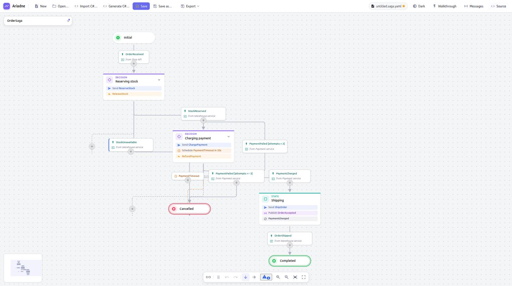

# Ariadne

Diagrams for [MassTransit saga state machines](https://masstransit.massient.com/guides/saga-state-machines). Build a saga as a picture, keep it in git as a small YAML file, and read it side by side with the code.

Ariadne is a web app (Angular + [Foblex f-flow](https://github.com/Foblex/f-flow)). Diagrams are plain local files, so they diff and review like code. It is **documentation only**: diagrams are never executed.



## The model

A diagram is a saga **state machine**, the way MassTransit sagas are written:

| In the diagram                                                   | In MassTransit                                                     |
| ---------------------------------------------------------------- | ------------------------------------------------------------------ |
| **Initial state** (green) and **final state** (red, double ring) | `Initial` / `Final`                                                |
| **State** (card)                                                 | `State`                                                            |
| **Transition** (arrow)                                           | `During(State, When(Event).TransitionTo(Next))`                    |
| **Event** on a transition                                        | `Event<T>`: what moves the saga on                                 |
| **External event** (teal, with its source)                       | an event published by another service, e.g. `from Payment service` |
| **Activities** on a state: _Send_ a command, _Publish_ an event  | `WhenEnter(State, b => b.Send(..).Publish(..))`                    |
| **Decision** (violet): a state with several transitions          | several `When(...)` in one `During(...)`                           |
| **Compensation** on a state                                      | the undo action for the work done to reach it                      |

States do things; transitions react to events. A command is sent to exactly one consumer and named in the imperative (`ChargePayment`), an event is published to any number of subscribers and named in the past tense (`OrderAccepted`). The inspector hints at this when a name doesn't follow the convention. An event is **internal** when some state publishes it and **external** otherwise; Ariadne works that out from the diagram.

## What you can do

- **Build** a saga by clicking "+": after a state, or on a transition to insert a state into it. Dragging from a state's connector onto another state adds a transition. Nothing is placed by hand: the layout is automatic (top to bottom or left to right) and always tidy.
- **Edit** the selection in the inspector: name, description, color, activities, compensation, retry and timeout for states; event, event source and kind for transitions.
- **Edit the source** next to the diagram: the **Source** button in the toolbar opens the YAML in a split view. Typing updates the diagram a moment later, editing the diagram updates the text, and a problem in the text is shown with its line and column while the diagram keeps its last valid state. Drag the divider to resize the panel.
- **Undo and redo** every edit (`Ctrl+Z`, `Ctrl+Shift+Z`).
- **Open and save** diagrams as `*.saga.yaml` files (`Ctrl+O`, `Ctrl+S`, `Ctrl+Shift+S`); older `.yaml` files still open. Where the browser allows it (Chrome, Edge) saving overwrites the opened file; otherwise it downloads a copy.
- **Switch the theme** with the toggle in the top bar: light, dark, or (until you choose) your system's setting. When Ariadne is embedded, the host can set it with `postMessage({ type: 'ariadne:theme', kind })`, `kind` being `light`, `dark`, `high-contrast` or `high-contrast-light`.
- **Use the keyboard.** `Tab` reaches the diagram once; then the arrows move between states and transitions (selecting them), `Ctrl`+arrow follows a transition, `Home`/`End` jump to the first or last state, `Ctrl+A` selects all, `Esc` clears, `Delete` removes the selection, `+`/`-`/`0` zoom. `Tab` on reaches the "+" buttons (`Enter` opens the picker), the inspector and the toolbar. Screen readers hear each state and transition and a live announcement of the selection; `prefers-reduced-motion` turns the animated fit and centring off.
- **Old files keep working.** Earlier file versions are migrated on open, and the app tells you what changed.

## Getting started

You need Node.js (see `.nvmrc`) and [pnpm](https://pnpm.io) (enabled with `corepack enable`). Ariadne uses pnpm only.

```sh
pnpm install
pnpm start        # dev server on http://localhost:4200
```

Then open `docs/examples/order.saga.yaml` with **Open…** to see the diagram above.

Other commands:

```sh
pnpm test            # unit tests (Vitest)
pnpm lint            # ESLint
pnpm format:check    # Prettier (pnpm format fixes)
pnpm build           # production build in apps/web/dist/
```

## Diagram files

A diagram is one YAML file, named `*.saga.yaml`. Only the graph is stored, no positions, so diffs show real changes to the saga:

```yaml
version: 3
direction: top-bottom
nodes:
  - { id: start-1, type: start, name: Initial }
  - id: state-1
    type: state
    name: Reserving stock
    activities:
      - command: ReserveStock
  - { id: end-1, type: end, name: Completed }
edges:
  - id: edge-1
    source: start-1
    target: state-1
    event: OrderReceived
    eventSource: Shop API
  - { id: edge-2, source: state-1, target: end-1, event: StockReserved }
```

The full format, with every field and the migration rules, is in [docs/specs/diagram-format.md](docs/specs/diagram-format.md). A complete example is [docs/examples/order.saga.yaml](docs/examples/order.saga.yaml).

## Project layout

```
apps/
  web/        the Angular editor
    src/app/
      model/      the diagram store with undo/redo (NgRx SignalStore)
      editor/     the canvas, state cards, transition labels, inspector, auto-layout, source panel
      storage/    FileStorage (open/save behind an interface) and the document service
      export/     SVG, PNG, Mermaid and Markdown
packages/
  core/       @ariadne/core: model, YAML format, validation, layout, catalog, walkthrough (no framework)
docs/
  adr/        architecture decision records
  specs/      the diagram file format
  examples/   sample diagrams
```

The repository is a pnpm workspace (`apps/*`, `packages/*`); the root scripts run across all of it.

Decisions are recorded as ADRs: [the foundations](docs/adr/0001-flow-editor-foundations.md), [YAML files and `FileStorage`](docs/adr/0002-yaml-files-and-file-storage.md), [state machines with auto-layout, commands and events](docs/adr/0003-auto-layout-commands-events.md), [app state in NgRx SignalStore](docs/adr/0004-ngrx-signal-store.md), [activities belong to states](docs/adr/0005-activities-on-states.md), [the TypeScript monorepo](docs/adr/0006-typescript-monorepo.md), [the source view](docs/adr/0008-source-view.md), [validation, message catalog and walkthrough](docs/adr/0012-validation-catalog-walkthrough.md).

## Roadmap

Work is tracked on the [project board](https://github.com/users/GravionLabs/projects/11) as Epic → Feature → PBI → Task, with GitHub sub-issues.

- **[v1.0 Web](https://github.com/GravionLabs/ariadne/milestone/2)**: a self-hosted web app. Import a saga from C# and generate C# from a diagram (all in TypeScript), exports (Mermaid, SVG, PNG, Markdown), validation, a dark theme, a TypeScript monorepo with a CLI, and a container for self-hosting.
- **[v1.1 VS Code](https://github.com/GravionLabs/ariadne/milestone/1)**: a VS Code extension that opens diagrams next to the code and shows when diagram and code drift apart.
- A Tauri desktop shell is possible, as native features sit behind interfaces, but it is on hold.

## Contributing

- pnpm only. Never npm or yarn.
- Native features (file access) go behind an interface, so the web build works without a desktop shell.
- Architectural changes get an ADR in `docs/adr/`.
- Issues follow Epic → Feature → PBI → Task (Bug → Task) with native sub-issues, not checklists. Branches are named `feature/<issue>-<slug>`, and commits and PRs reference the issue.
