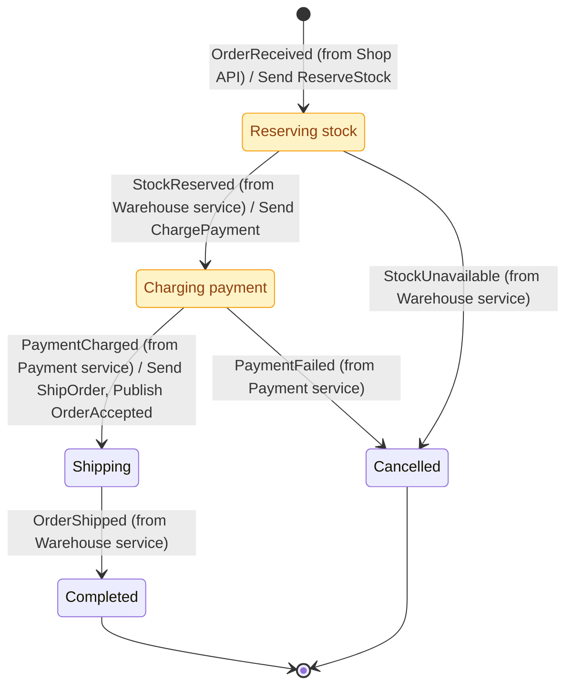

# order

## Diagram

## States

| State            | Type     | Description                                                      | Activities                              | Compensation  | Retry      | Timeout |
| ---------------- | -------- | ---------------------------------------------------------------- | --------------------------------------- | ------------- | ---------- | ------- |
| Initial          | Initial  |                                                                  |                                         |               |            |         |
| Reserving stock  | Decision | Waits for the warehouse to confirm that the items are available. | Send ReserveStock                       | ReleaseStock  |            |         |
| Charging payment | Decision | Waits for the payment service.                                   | Send ChargePayment                      | RefundPayment | 3 attempts | 30s     |
| Shipping         | State    |                                                                  | Send ShipOrder Publish OrderAccepted |               |            |         |
| Completed        | Final    |                                                                  |                                         |               |            |         |
| Cancelled        | Final    |                                                                  |                                         |               |            |         |

## Transitions

| From             | Event            | Source            | To               | Kind    |
| ---------------- | ---------------- | ----------------- | ---------------- | ------- |
| Initial          | OrderReceived    | Shop API          | Reserving stock  | Forward |
| Reserving stock  | StockReserved    | Warehouse service | Charging payment | Forward |
| Reserving stock  | StockUnavailable | Warehouse service | Cancelled        | Forward |
| Charging payment | PaymentCharged   | Payment service   | Shipping         | Forward |
| Charging payment | PaymentFailed    | Payment service   | Cancelled        | Forward |
| Shipping         | OrderShipped     | Warehouse service | Completed        | Forward |

## Commands

| Command       | Sent in          |
| ------------- | ---------------- |
| ChargePayment | Charging payment |
| ReserveStock  | Reserving stock  |
| ShipOrder     | Shipping         |

## Events

| Event            | Origin   | Published in | Triggers                           |
| ---------------- | -------- | ------------ | ---------------------------------- |
| OrderAccepted    | Internal | Shipping     |                                    |
| OrderReceived    | External |              | Initial → Reserving stock          |
| OrderShipped     | External |              | Shipping → Completed               |
| PaymentCharged   | External |              | Charging payment → Shipping        |
| PaymentFailed    | External |              | Charging payment → Cancelled       |
| StockReserved    | External |              | Reserving stock → Charging payment |
| StockUnavailable | External |              | Reserving stock → Cancelled        |
