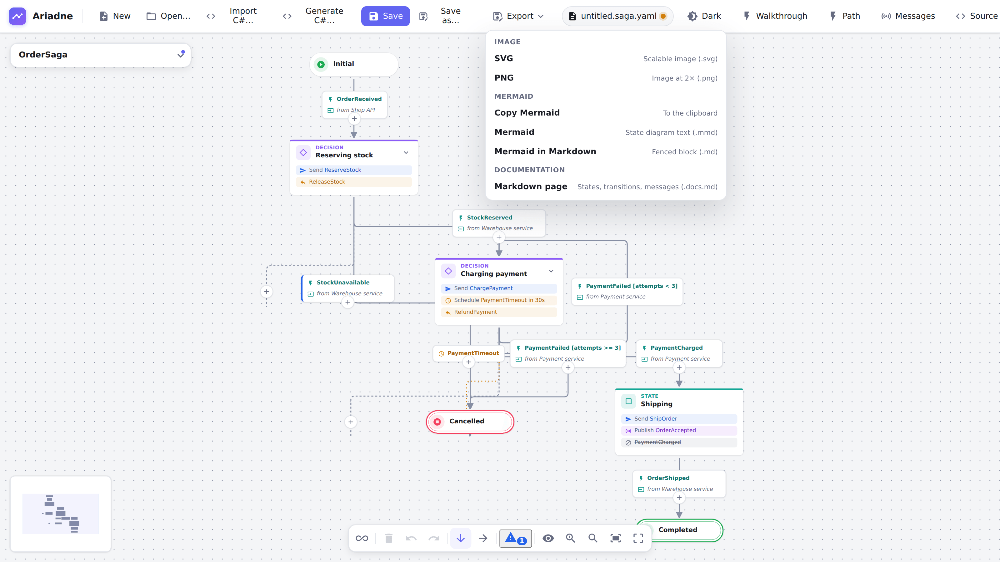
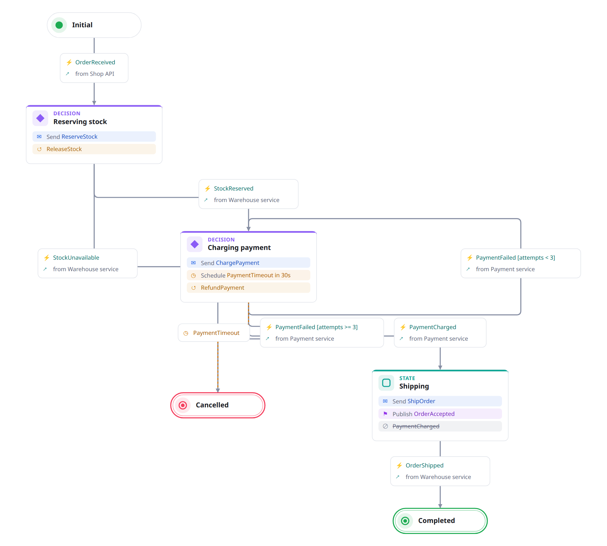
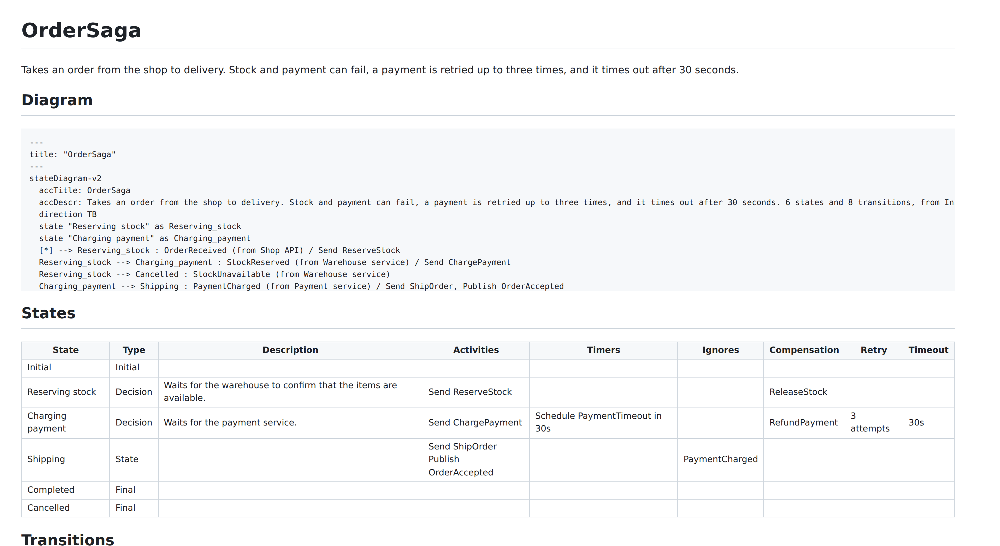

# Exports

The **Export** menu in the top bar:

| Entry                        | Result                                                                                                       |
| ---------------------------- | ------------------------------------------------------------------------------------------------------------ |
| SVG, PNG                     | The diagram as an image (PNG at 2×, smaller if that would be over 16 384 px). Saved through the file dialog. |
| Copy Mermaid                 | Mermaid state-diagram text on the clipboard.                                                                 |
| Mermaid, Mermaid in Markdown | `.mmd` text, or a fenced block in a `.md` file, for READMEs and wikis.                                       |
| Markdown page                | A page about the saga: states, transitions, messages (`.docs.md`).                                           |

<picture>
  <source media="(prefers-color-scheme: dark)" srcset="../images/guide/export-menu-dark.png">
  
</picture>





In VS Code, **Ariadne: Export Diagram…** (a button in the diagram editor's title bar, or the Command Palette) saves the
SVG, PNG, Mermaid or Markdown page next to the diagram, or in the folder of `ariadne.export.folder`, and copies Mermaid or
Markdown to the clipboard. The Markdown preview draws a saga from a fenced block, or from a file:

````markdown
```saga
version: 3
nodes: []
```


````

From the command line, for CI and docs builds (install it from a release: `npm install -g
https://github.com/GravionLabs/ariadne/releases/latest/download/ariadne-cli.tgz`, Node 22 or later):

```sh
ariadne export order.saga.yaml --format svg -o order.svg     # mermaid | svg | png | md
ariadne lint docs/*.saga.yaml --max-warnings 0               # exit code 1 on errors
```

An image export shows the diagram as it is drawn; the title and description come from the saga's details.

## Text alternatives

A picture is no use to someone who cannot see it, so the exports say what is in it (WCAG 1.1.1):

- **SVG** has a `<title>` (the saga's name, or "Saga diagram") and a `<desc>` (the saga's description, then a
  sentence such as _5 states and 7 transitions, from Initial to Completed or Cancelled._), and is marked
  `role="img"`, so a screen reader reads them when the SVG is on a page.
- **Mermaid** text has `accTitle` and `accDescr` with the same words; GitHub draws them into the title and
  description of the diagram it renders. The **Markdown page** has them in its diagram, and its tables have header
  rows.
- The **Markdown preview in VS Code** gives the image the same words as its `alt` text.
- **PNG** has no text alternative of its own: a file of pixels cannot carry one. Where the picture goes into a
  document, give it an `alt` text there, or use the SVG or the Markdown page instead.
