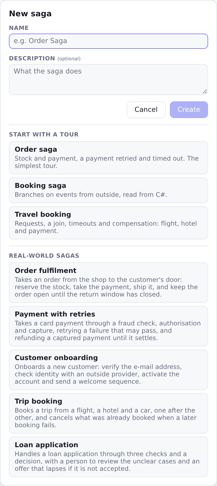
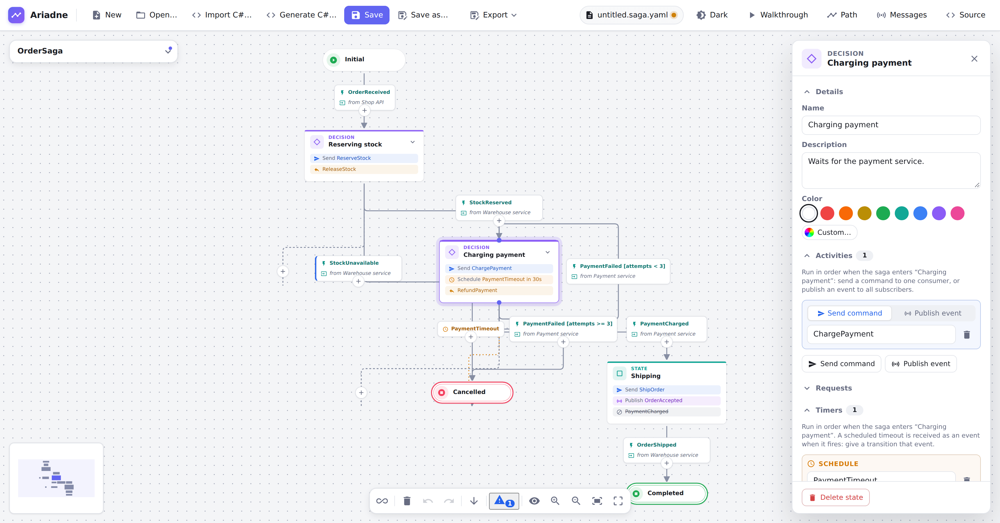
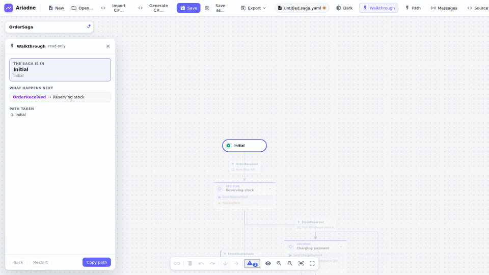
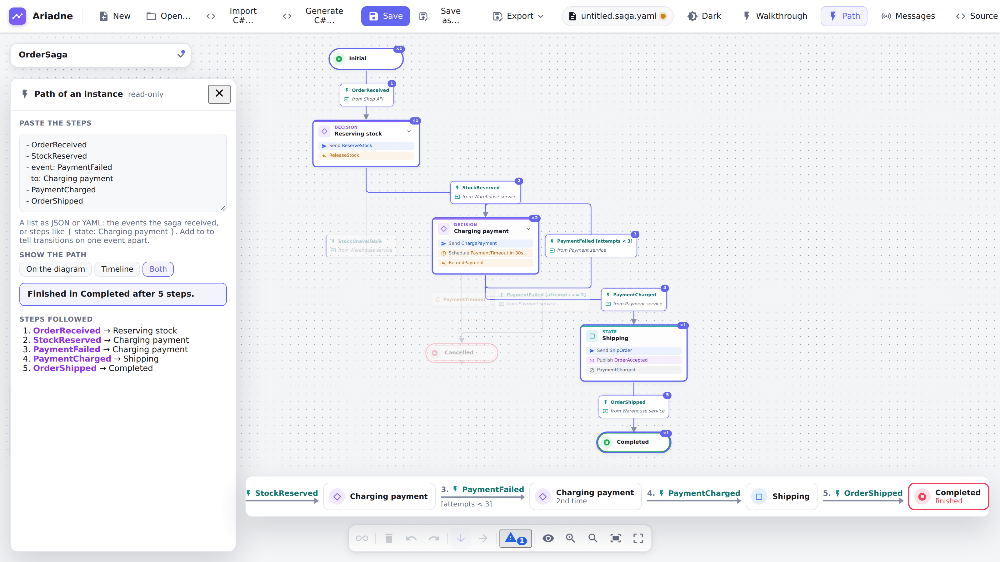
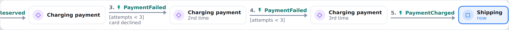
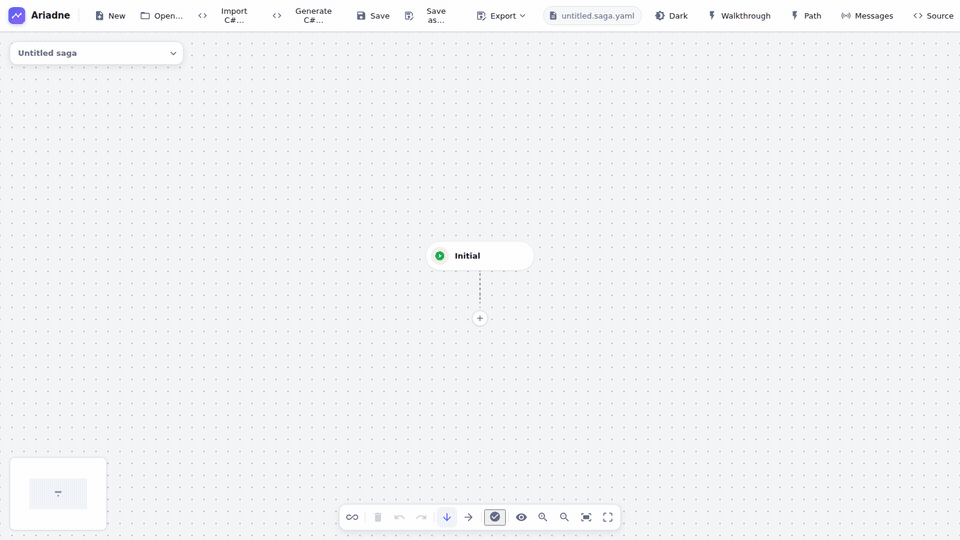
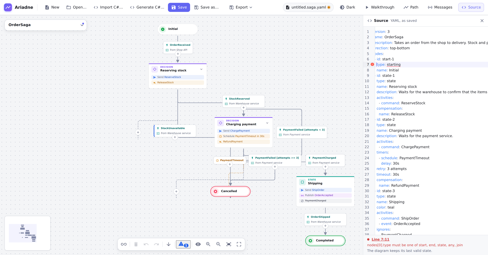

# Getting started

## Open the editor

- **In your browser, nothing to install:** the [demo](https://gravionlabs.github.io/ariadne/app/). Your diagrams stay in
  the browser; **Save** writes a file on your computer.
- **Hosted by your team:** open the address they gave you. See [self-hosting](../self-hosting.md) to run it
  yourself with one `docker run`.
- **From the repository:** `pnpm install`, then `pnpm start`, and open <http://localhost:4200>.

## Look at a sample

Choose **New** and, under "Start with a tour", the _Order saga_ (under "Real-world sagas" there are bigger ones: [the sample library](../../samples/library/README.md)). It opens as a new diagram that is not saved
anywhere yet. Click a state or a transition: the inspector on the right shows what it is. **Walkthrough** steps
through the saga event by event, **Messages** lists its commands and events and where they are used, and **Path**
draws the path a saga instance took: paste the events it received (a JSON or YAML list, e.g. `- OrderReceived`) and the
diagram shows the states visited, the transitions taken with their step numbers, and where the instance stands. A
**timeline** under the canvas lists the same path left to right: only the states it went through and the event of each
step, a loop as often as it was taken, the state it is in now emphasised. Click a state or a step to find it on the
diagram. The panel chooses between **On the diagram**, **Timeline** and **Both**. To see it at once, open the
[order sample with an example path](https://gravionlabs.github.io/ariadne/app/?sample=order&path=example) in the demo.

<picture>
  <source media="(prefers-color-scheme: dark)" srcset="../images/guide/new-dialog-dark.png">
  
</picture>

<picture>
  <source media="(prefers-color-scheme: dark)" srcset="../images/guide/order-inspector-dark.png">
  
</picture>

<picture>
  <source media="(prefers-color-scheme: dark)" srcset="../images/guide/path-panel-dark.png">
  
</picture>

<picture>
  <source media="(prefers-color-scheme: dark)" srcset="../images/guide/path-timeline-dark.png">
  
</picture>

## Draw your own

1. **New**, give the saga a name.
2. Click the **+** under the initial state and pick a state. Click **+** again to continue the path.
3. To add a state _into_ an existing path, click the **+** on a transition.
4. Drag from a state's connector onto another state to add a transition (for a loop, a retry or a branch back).
5. Select a transition and give it an **event**, e.g. `PaymentCharged`. Select a state and add **activities**: the
   commands it sends and the events it publishes when the saga enters it.

Nothing is positioned by hand; the layout follows the structure. **Top to bottom** and **Left to right** switch the
direction.

## Save

**Save** (`Ctrl+S`) writes a `*.saga.yaml` file. In Chrome and Edge it overwrites the file you opened; in other
browsers it downloads a copy. The file is plain YAML, made for code review: keys are always in the same order, so
a change shows up as a small diff. Put it in your repository next to the saga's code.

If the browser crashes or the tab is closed before you save, the editor keeps your unsaved changes in the browser
(a second after your last edit) and offers them back the next time you open it: **Restore** opens them as an unsaved
diagram, **Discard** throws them away. The draft is removed as soon as you save or discard your changes. It is not
used in VS Code, which keeps unsaved documents itself.

The **Source** button shows the YAML next to the diagram. You can edit either side; a mistake in the text is shown
with its line and column and the diagram keeps its last valid state.

<picture>
  <source media="(prefers-color-scheme: dark)" srcset="../images/guide/source-error-dark.png">
  
</picture>

## Next

[Modelling sagas](modelling.md)
