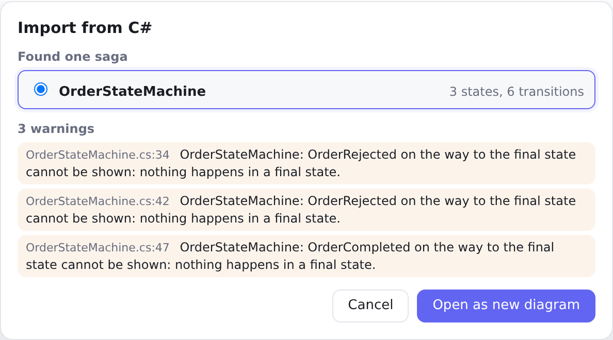
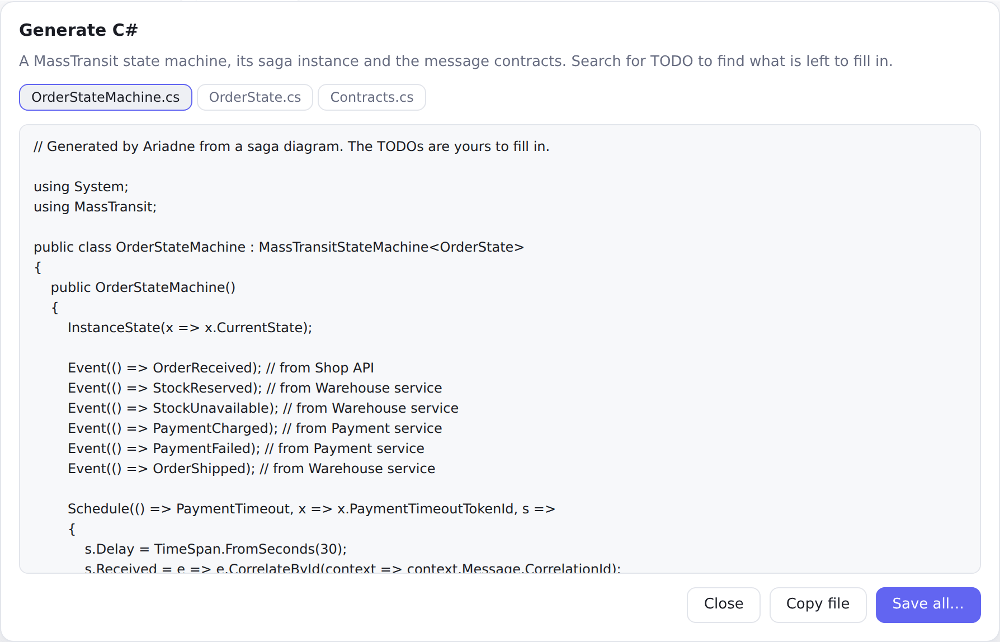

# Import and generate C#

Ariadne converts in both directions and can check that the two still agree. Everything runs in your browser (or on
your machine, for the command line): source code is never sent anywhere.

## Import from C#

**Import C#…** takes one or more `.cs` files, finds the classes derived from `MassTransitStateMachine<T>` and shows
what it found. Pick a saga and choose **Open as new diagram**.

What is read: `Initially`, `During`, `DuringAny` and `WhenEnter`; `When(Event)` with an optional filter (shown as a
guard); `TransitionTo`, `Finalize` and `Ignore`; `Send` and `Publish` (shown as activities of the target state);
helper methods of the same class; partial classes spread over several files; `Event(() => E, x => x.CorrelateById(...))`.

What is not drawn is listed as a **warning with file and line**: code that runs in `Then(...)`,
`Fault`, `OnUnhandledEvent` and their declarations in the constructor, or a base class that
cannot be resolved. The diagram is a view of the structure, not of every
line of code.

The result opens as a new, unsaved diagram. Import never changes your code.

<picture>
  <source media="(prefers-color-scheme: dark)" srcset="../images/guide/import-dialog-dark.png">
  
</picture>

## Generate C#

**Generate C#…** writes a MassTransit state machine, a saga instance and the message contracts. The dialog shows
each file; **Copy file** copies one, **Save all…** writes them into a folder you choose (or one zip, in browsers
without a folder picker).

The generated code is a starting point:

- search for `TODO`: the properties of the messages, and every guard, are left for you;
- what a diagram cannot say, such as a transition without an event, is not generated and is listed in the dialog;
- names are turned into C# identifiers (`Charging payment` → `ChargingPayment`), and a clash gets a number.

Save generated files where you want them; Ariadne never overwrites a project.

<picture>
  <source media="(prefers-color-scheme: dark)" srcset="../images/guide/generate-dialog-dark.png">
  
</picture>

## In VS Code

The [extension](vscode.md) does the same next to the code:

- **Import:** a CodeLens above a `MassTransitStateMachine<T>` class says **Import as saga diagram** (also
  **Ariadne: Import Saga from C#…**). It writes `<Class>.saga.yaml`, records the C# file in the diagram's
  `saga.source`, and opens it. If the diagram already exists and differs, you see a diff first.
- **Generate:** **Ariadne: Generate C#** (a button in the diagram editor's title bar) lists the files; pick the ones
  to write and compare changed ones first. The folder and namespace come from the diagram's saga details or the
  `ariadne.generate.*` settings.
- **Drift:** when a diagram names its C# file, saving either one compares them. Differences show in the Problems panel
  on both files, with the quick fixes **Update diagram from code** and **Open diff**. `ariadne.drift.enabled` turns it off.
- **Go to code:** in the inspector, the button on a state or transition opens the C# at that place. The CodeLens above
  a class that has a diagram reads **Open saga diagram**.

## Command line

```sh
ariadne generate order.saga.yaml -o src/Orders       # diagram -> C#
ariadne import src/Orders/*.cs -o docs               # C# -> diagram
ariadne diff docs/order.saga.yaml src/Orders/*.cs    # exit code 1 when they differ
```

`diff` lists the states, transitions, sent and published messages, ignored events, and the message type and
correlation of events that exist only on one side. Names are compared as C# identifiers; guards, layout, colours and
descriptions are not compared. Put `ariadne diff` in your CI to notice when the diagram and the code drift apart.

## Why it round-trips

Generating C# from a diagram and importing it again gives the same diagram (the tests check this for every sample).
A guard is the exception: it is free text in the diagram and a `TODO` condition in the code.
