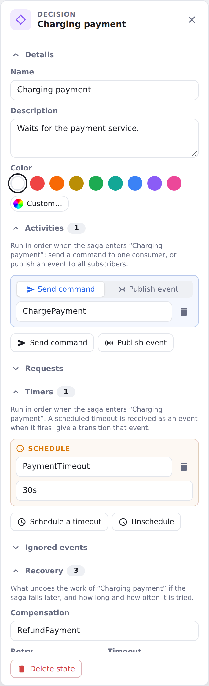
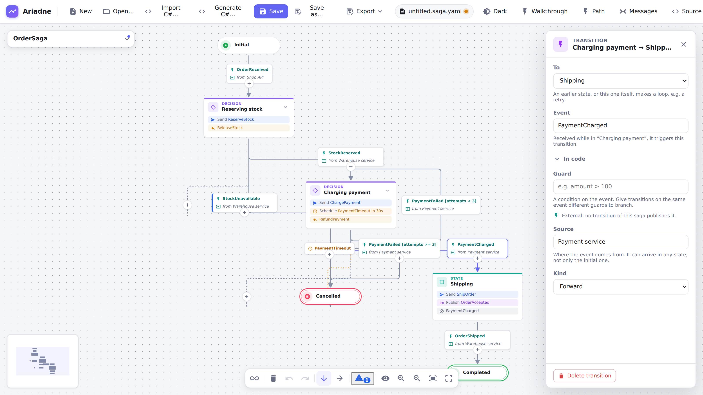
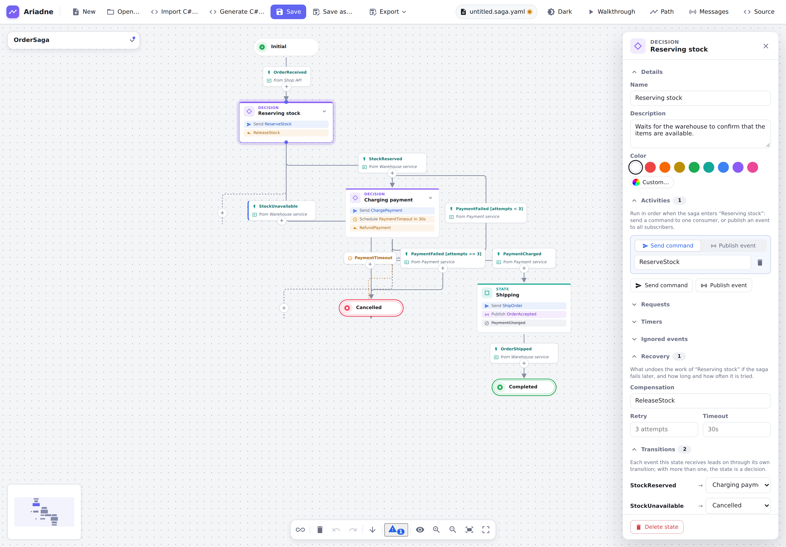
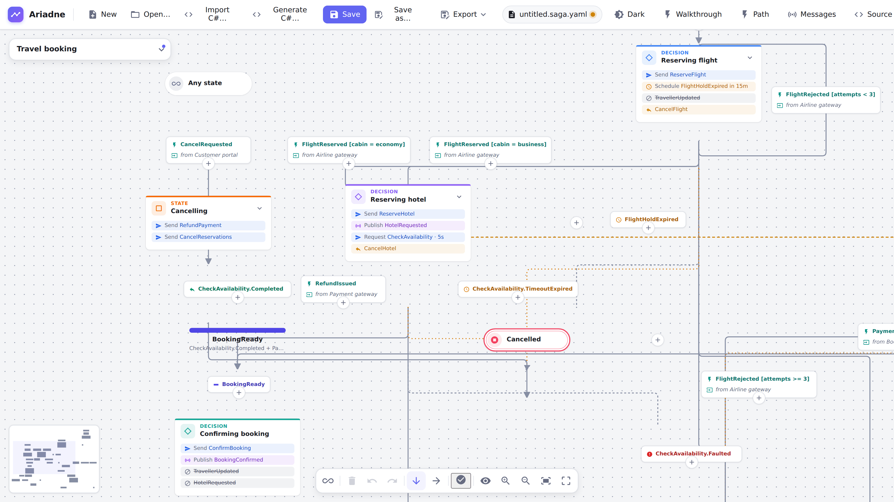
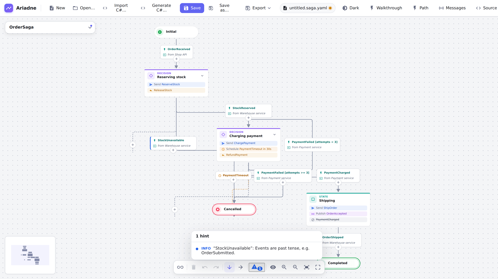

# Modelling sagas

A diagram is a saga **state machine**, the way MassTransit writes it. States do things; transitions react to events.

| In the diagram                           | In MassTransit                                     |
| ---------------------------------------- | -------------------------------------------------- |
| Initial state (green), final state (red) | `Initial`, `Final`                                 |
| State                                    | `State`                                            |
| Transition with an event                 | `During(State, When(Event).TransitionTo(Next))`    |
| Activities of a state                    | `WhenEnter(State, b => b.Send(...).Publish(...))`  |
| Any state                                | `DuringAny(When(Event)...)`                        |
| Ignored events of a state                | `During(State, Ignore(Event))`                     |
| Requests and timeouts of a state         | `Request` and `Schedule`                           |
| Join                                     | `CompositeEvent`                                   |
| Compensation                             | the undo action for the work that led to the state |

**View mode:** the eye button in the toolbar hides the "+" buttons and the dotted lines that lead to them, to read a
diagram or take a screenshot. Nothing else changes (you can still select, use the inspector and the keyboard). It lasts
until you switch it off or close the editor: the editor always opens in edit mode. Exports never contain the "+"
buttons.

**Adding a state:** the "+" after a state (or on a transition) opens a popover for a new **state**, with a switch for
a join or a final state. It asks for the **event** of the new transition (with the suggestions of the inspector's Event
field) and the **name** of the new state. The event field has the focus; `Enter` adds everything as one undo step.
`Esc`, or leaving the fields empty, adds the state with the default name and no event. "To a new state" and "To a
final state" in the inspector ask the same way. On a transition A → B the event you give belongs to the transition from
the new state to B; the one into it keeps its own.

**From the keyboard:** with a state selected, `N` opens the same popover for a following state, `F` for a final state
and `C` connects to an existing state; with a transition selected, `E` edits its event (all in
[Keyboard shortcuts](shortcuts.md)).

**Editing in place:** double-click a state, or select it and press `F2`, to turn its name into a text field; a
transition's event works the same way, on its label. `Enter` or leaving the field commits as one undo step, `Esc`
cancels, and an empty state name puts the old one back. Editing is not available while walking through the saga or
viewing a path.

A transition without an event shows a faint "+ event" chip where its label would be; click it, or select the
transition and press `F2`, to type the event. The chip is not shown in view mode, the walkthrough or the path view, nor
in the exports and the viewer, but its room is reserved, so adding the event does not move the diagram.

## States

A state has a name, an optional description and colour, and optionally:

- **Activities**, in order: _Send command_ (to exactly one consumer, named in the imperative: `ChargePayment`) or
  _Publish event_ (to any subscribers, named in the past tense: `OrderAccepted`). The inspector hints when a name
  doesn't follow that convention.
- **Requests** (`ValidateAddress`): the reply arrives as `ValidateAddress.Completed`, `.Faulted` or
  `.TimeoutExpired`; draw a transition for each outcome you handle, or let "Add transitions for its outcomes" add them.
- **Routing slips** (`Provision`): a MassTransit Courier itinerary the state starts when it is entered, its
  activities in order. Mark an activity **compensates** when Courier can undo it; on a fault the inspector shows the
  order they are undone in (last first). The slip ends as `Provision.Completed` or `Provision.Faulted`; draw a
  transition from the same state for each outcome you handle, or let "Add transitions for its outcomes" add them. A state waits for the outcomes of one slip only: C#
  cannot tell two apart.
- **Timeouts**: schedule one when the state is entered (`PaymentTimeout`, `30s`) or cancel it. A transition on the
  timeout's name is the timeout path.

  For a request, a scheduled timeout and a routing slip alike, "Add transitions for its outcomes" in the inspector adds
  one transition to a new state for each outcome the state does not react to yet, with the event filled in, as one undo
  step. It is not offered when none is missing.

- **Ignored events**, **retry** and **timeout** notes, and a **compensation** (name and description).

Only plain states can have these; the initial and final states cannot.

The inspector keeps a state short: **Details**, **Activities** and **Transitions** are always shown; requests, routing
slips, timers, ignored events and recovery appear when the state has entries. **Add behavior…**, below the Transitions, lists the hidden ones;
picking one shows its section with a new entry focused. Removing the last entry takes the section away again.

<picture>
  <source media="(prefers-color-scheme: dark)" srcset="../images/guide/state-activities-dark.png">
  
</picture>

## Transitions

A transition says: while the saga is in the source state, this **event** moves it to the target. Several transitions
from one state make a **decision**. Give transitions of the same event different **guards** (`amount > 100`) to
branch on a condition.

The **Transitions** list of a state shows each outgoing transition with an editable event (with the same suggestions
as the transition's own Event field) and its target; to give the branches of a decision their events, there is no
need to select each transition in turn. An event that would duplicate another transition of the same states is
refused and the old one put back.

The Event field suggests, first, what the source state makes possible (the outcomes of its requests and routing slips,
its scheduled timeouts), then the same for the other states, the events the saga publishes, the events of other
transitions and the events known from code (a C# import). An event another transition leaving the same state already
reacts to is left out.

A transition back to the same state is a loop (a retry). A **compensation** transition is drawn differently and is not
laid out; use it for the path back after a failure.

<picture>
  <source media="(prefers-color-scheme: dark)" srcset="../images/guide/external-event-dark.png">
  
</picture>

<picture>
  <source media="(prefers-color-scheme: dark)" srcset="../images/guide/compensation-dark.png">
  
</picture>

## Events: internal and external

An event is **internal** when some state publishes it, and **external** otherwise. Ariadne works that out; you only
set the **source** of an external event (`Payment service`) so the diagram says where it comes from. External events
can arrive in any state, not only the first. Other kinds are recognised too: timeouts, replies, faults, the outcomes of a routing slip
and composite events of a join.

## Any state and join

- **Any** (the button in the toolbar) holds transitions that apply in every state, e.g. `OrderCancelled`. There is
  at most one.
- A **join** waits until the events of all its incoming transitions have arrived, then continues.

<picture>
  <source media="(prefers-color-scheme: dark)" srcset="../images/guide/any-and-join-dark.png">
  
</picture>

## Code details

For the C# round trip, the **Code** section of the saga's details holds the state machine class, namespace, saga instance type
and state property; a transition's event can name its **message type** and **correlation**. All optional: the
generator derives names from the diagram. See [Import and generate C#](import-and-generate.md).

## Problems

The **Problems** menu lists what looks wrong: a state that cannot be reached or has no way to a final state, an
event that leaves a state twice without a guard, a transition without an event, an external event without a source. Select an entry to jump to it. `ariadne lint` reports the same in CI.

<picture>
  <source media="(prefers-color-scheme: dark)" srcset="../images/guide/problems-menu-dark.png">
  
</picture>
