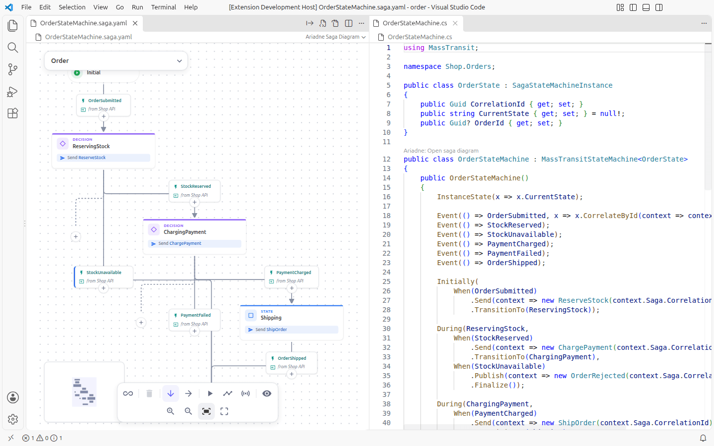
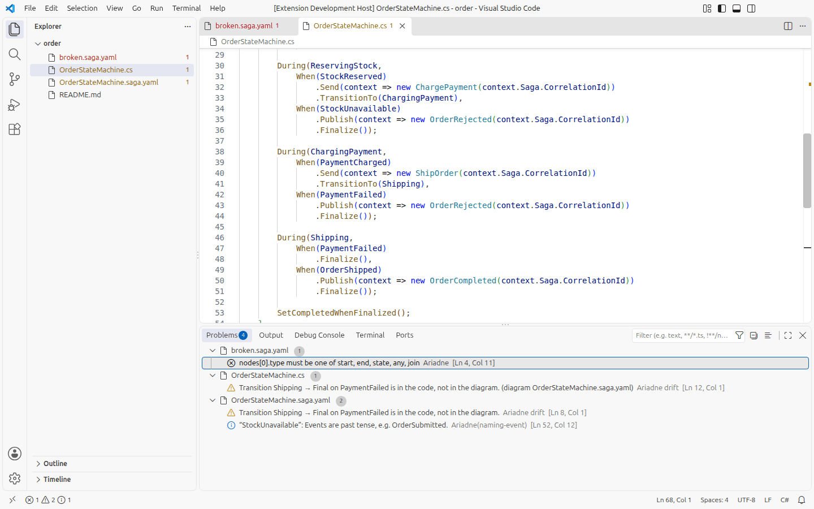
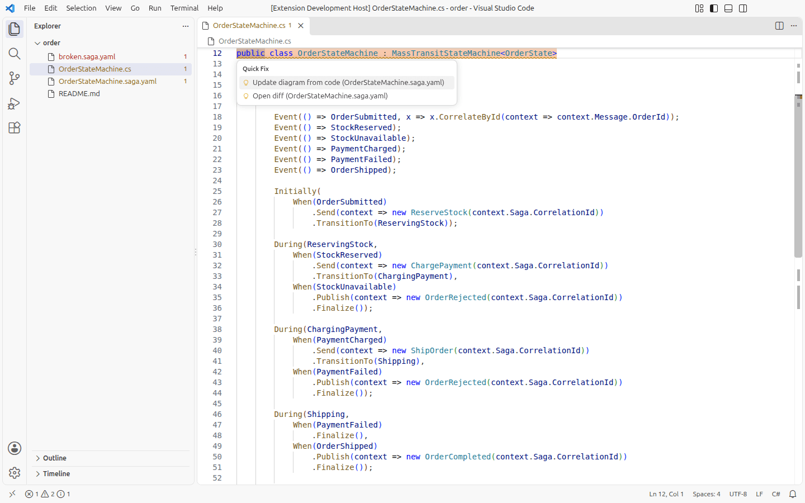
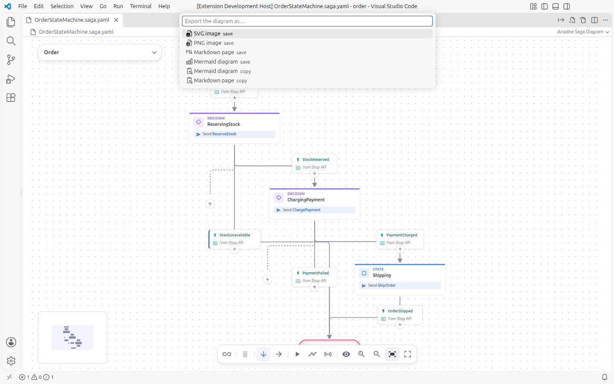
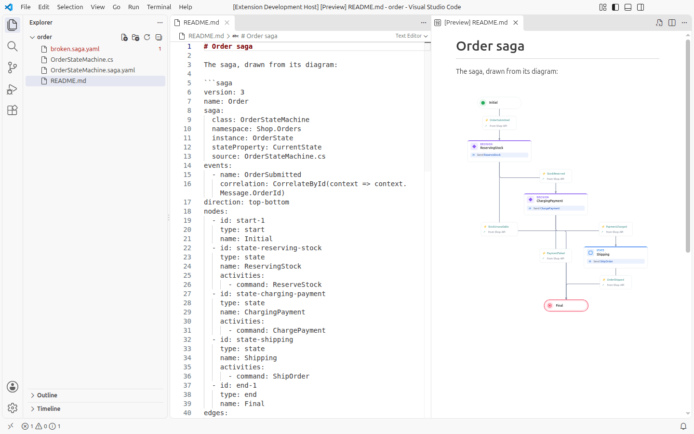

# Ariadne in VS Code

The VS Code extension opens `*.saga.yaml` files as diagrams, next to the C# that implements them. The file stays a
normal text document, so save, undo, git and "Open with Text Editor" work as always. The extension also imports
and generates C#, shows where a diagram and its code have drifted apart, exports, and draws sagas in the Markdown
preview. Every command and setting is listed in [the extension's README](../../apps/vscode/README.md).

<picture>
  <source media="(prefers-color-scheme: dark)" srcset="../images/guide/vscode-editor-and-code-dark.png">
  
</picture>

## Install

The extension is not in a marketplace yet; every release of Ariadne carries it as a file.

1. Open the [latest release](https://github.com/GravionLabs/ariadne/releases/latest) and download
   `ariadne-vscode-<version>.vsix`.
2. Install it, either
   - in a terminal: `code --install-extension ariadne-vscode-<version>.vsix`, or
   - in VS Code: Extensions view → "…" menu → **Install from VSIX…** and pick the file.
3. Open a folder with a `*.saga.yaml` file, or run **Ariadne: New Saga Diagram** from the Command Palette.

There are no automatic updates: to update, install the newer `.vsix` over the old one. To remove it, uninstall
"Ariadne" in the Extensions view. For YAML completion and validation while you edit the text, also install the
[Red Hat YAML extension](https://marketplace.visualstudio.com/items?itemName=redhat.vscode-yaml); Ariadne
contributes the schema for it.

## Work next to the code

When a diagram names its C# file (`saga.source`), saving either one compares them. A difference is a warning in
the **Problems** panel on both files, and a quick fix on the C# or the diagram updates the diagram from the code
or opens a diff. A diagram that cannot be read is listed there too, on its line.

<picture>
  <source media="(prefers-color-scheme: dark)" srcset="../images/guide/vscode-problems-dark.png">
  
</picture>

<picture>
  <source media="(prefers-color-scheme: dark)" srcset="../images/guide/vscode-drift-quick-fix-dark.png">
  
</picture>

**Ariadne: Export Diagram…** asks for the format, then saves the file next to the diagram or copies the text.

<picture>
  <source media="(prefers-color-scheme: dark)" srcset="../images/guide/vscode-export-quick-pick-dark.png">
  
</picture>

The Markdown preview draws a saga from a fenced block, or from a file, as an image of the diagram.

<picture>
  <source media="(prefers-color-scheme: dark)" srcset="../images/guide/vscode-markdown-preview-dark.png">
  
</picture>

## Next

- Import a state machine: a CodeLens above the class says **Import as saga diagram** ([import and generate](import-and-generate.md)).
- Model a saga: [modelling](modelling.md).
- Export: [exports](exports.md); in VS Code use **Ariadne: Export Diagram…**.
