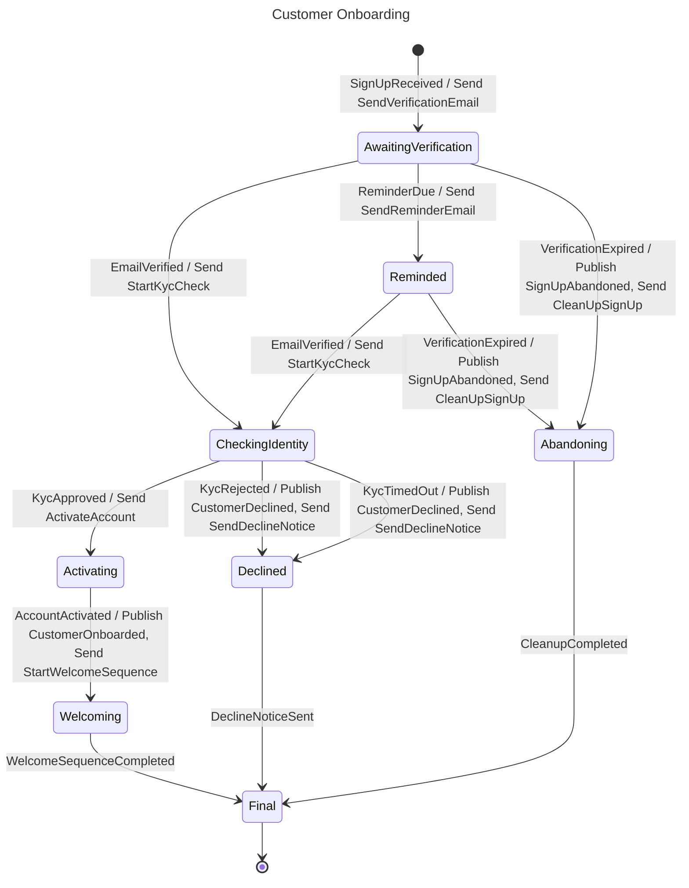

# Customer Onboarding

## Diagram

## States

| State | Type | Description | Activities | Compensation | Retry | Timeout |
| --- | --- | --- | --- | --- | --- | --- |
| Initial | Initial |  |  |  |  |  |
| AwaitingVerification | Decision |  | Send SendVerificationEmail |  |  |  |
| Reminded | Decision |  | Send SendReminderEmail |  |  |  |
| CheckingIdentity | Decision |  | Send StartKycCheck |  |  |  |
| Activating | State |  | Send ActivateAccount |  |  |  |
| Welcoming | State |  | Publish CustomerOnboarded Send StartWelcomeSequence |  |  |  |
| Abandoning | State |  | Publish SignUpAbandoned Send CleanUpSignUp |  |  |  |
| Declined | State |  | Publish CustomerDeclined Send SendDeclineNotice |  |  |  |
| Final | Final |  |  |  |  |  |

## Transitions

| From | Event | Source | To | Kind |
| --- | --- | --- | --- | --- |
| Initial | SignUpReceived | external | AwaitingVerification | Forward |
| AwaitingVerification | EmailVerified | external | CheckingIdentity | Forward |
| AwaitingVerification | ReminderDue | external | Reminded | Forward |
| AwaitingVerification | VerificationExpired | external | Abandoning | Forward |
| Reminded | EmailVerified | external | CheckingIdentity | Forward |
| Reminded | VerificationExpired | external | Abandoning | Forward |
| CheckingIdentity | KycApproved | external | Activating | Forward |
| CheckingIdentity | KycRejected | external | Declined | Forward |
| CheckingIdentity | KycTimedOut | external | Declined | Forward |
| Activating | AccountActivated | external | Welcoming | Forward |
| Welcoming | WelcomeSequenceCompleted | external | Final | Forward |
| Abandoning | CleanupCompleted | external | Final | Forward |
| Declined | DeclineNoticeSent | external | Final | Forward |

## Commands

| Command | Sent in |
| --- | --- |
| ActivateAccount | Activating |
| CleanUpSignUp | Abandoning |
| SendDeclineNotice | Declined |
| SendReminderEmail | Reminded |
| SendVerificationEmail | AwaitingVerification |
| StartKycCheck | CheckingIdentity |
| StartWelcomeSequence | Welcoming |

## Events

| Event | Origin | Published in | Triggers |
| --- | --- | --- | --- |
| AccountActivated | External |  | Activating → Welcoming |
| CleanupCompleted | External |  | Abandoning → Final |
| CustomerDeclined | Internal | Declined |  |
| CustomerOnboarded | Internal | Welcoming |  |
| DeclineNoticeSent | External |  | Declined → Final |
| EmailVerified | External |  | AwaitingVerification → CheckingIdentity Reminded → CheckingIdentity |
| KycApproved | External |  | CheckingIdentity → Activating |
| KycRejected | External |  | CheckingIdentity → Declined |
| KycTimedOut | External |  | CheckingIdentity → Declined |
| ReminderDue | External |  | AwaitingVerification → Reminded |
| SignUpAbandoned | Internal | Abandoning |  |
| SignUpReceived | External |  | Initial → AwaitingVerification |
| VerificationExpired | External |  | AwaitingVerification → Abandoning Reminded → Abandoning |
| WelcomeSequenceCompleted | External |  | Welcoming → Final |
