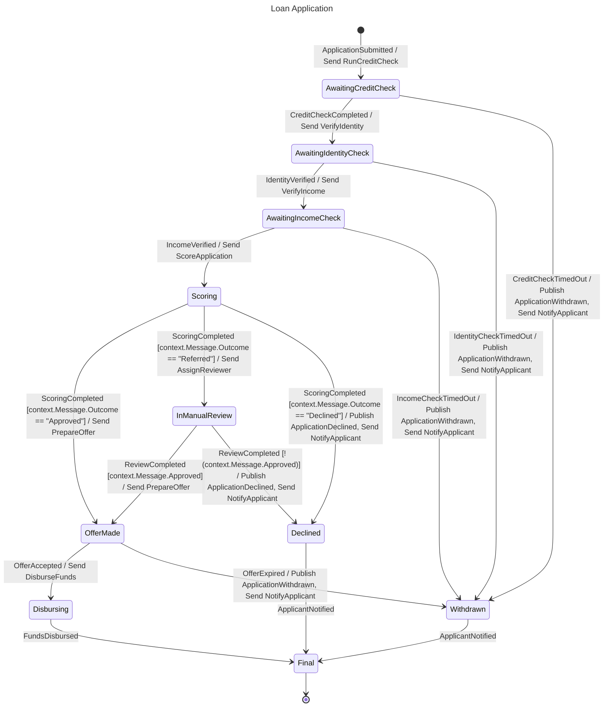

# Loan Application

## Diagram

## States

| State | Type | Description | Activities | Compensation | Retry | Timeout |
| --- | --- | --- | --- | --- | --- | --- |
| Initial | Initial |  |  |  |  |  |
| AwaitingCreditCheck | Decision |  | Send RunCreditCheck |  |  |  |
| AwaitingIdentityCheck | Decision |  | Send VerifyIdentity |  |  |  |
| AwaitingIncomeCheck | Decision |  | Send VerifyIncome |  |  |  |
| Scoring | Decision |  | Send ScoreApplication |  |  |  |
| InManualReview | Decision |  | Send AssignReviewer |  |  |  |
| OfferMade | Decision |  | Send PrepareOffer |  |  |  |
| Disbursing | State |  | Send DisburseFunds |  |  |  |
| Declined | State |  | Publish ApplicationDeclined Send NotifyApplicant |  |  |  |
| Withdrawn | State |  | Publish ApplicationWithdrawn Send NotifyApplicant |  |  |  |
| Final | Final |  |  |  |  |  |

## Transitions

| From | Event | Guard | Source | To | Kind |
| --- | --- | --- | --- | --- | --- |
| Initial | ApplicationSubmitted |  | external | AwaitingCreditCheck | Forward |
| AwaitingCreditCheck | CreditCheckCompleted |  | external | AwaitingIdentityCheck | Forward |
| AwaitingCreditCheck | CreditCheckTimedOut |  | external | Withdrawn | Forward |
| AwaitingIdentityCheck | IdentityVerified |  | external | AwaitingIncomeCheck | Forward |
| AwaitingIdentityCheck | IdentityCheckTimedOut |  | external | Withdrawn | Forward |
| AwaitingIncomeCheck | IncomeVerified |  | external | Scoring | Forward |
| AwaitingIncomeCheck | IncomeCheckTimedOut |  | external | Withdrawn | Forward |
| Scoring | ScoringCompleted | context.Message.Outcome == "Approved" | external | OfferMade | Forward |
| Scoring | ScoringCompleted | context.Message.Outcome == "Referred" | external | InManualReview | Forward |
| Scoring | ScoringCompleted | context.Message.Outcome == "Declined" | external | Declined | Forward |
| InManualReview | ReviewCompleted | context.Message.Approved | external | OfferMade | Forward |
| InManualReview | ReviewCompleted | !(context.Message.Approved) | external | Declined | Forward |
| OfferMade | OfferAccepted |  | external | Disbursing | Forward |
| OfferMade | OfferExpired |  | external | Withdrawn | Forward |
| Disbursing | FundsDisbursed |  | external | Final | Forward |
| Declined | ApplicantNotified |  | external | Final | Forward |
| Withdrawn | ApplicantNotified |  | external | Final | Forward |

## Commands

| Command | Sent in |
| --- | --- |
| AssignReviewer | InManualReview |
| DisburseFunds | Disbursing |
| NotifyApplicant | Declined, Withdrawn |
| PrepareOffer | OfferMade |
| RunCreditCheck | AwaitingCreditCheck |
| ScoreApplication | Scoring |
| VerifyIdentity | AwaitingIdentityCheck |
| VerifyIncome | AwaitingIncomeCheck |

## Events

| Event | Origin | Published in | Triggers |
| --- | --- | --- | --- |
| ApplicantNotified | External |  | Declined → Final Withdrawn → Final |
| ApplicationDeclined | Internal | Declined |  |
| ApplicationSubmitted | External |  | Initial → AwaitingCreditCheck |
| ApplicationWithdrawn | Internal | Withdrawn |  |
| CreditCheckCompleted | External |  | AwaitingCreditCheck → AwaitingIdentityCheck |
| CreditCheckTimedOut | External |  | AwaitingCreditCheck → Withdrawn |
| FundsDisbursed | External |  | Disbursing → Final |
| IdentityCheckTimedOut | External |  | AwaitingIdentityCheck → Withdrawn |
| IdentityVerified | External |  | AwaitingIdentityCheck → AwaitingIncomeCheck |
| IncomeCheckTimedOut | External |  | AwaitingIncomeCheck → Withdrawn |
| IncomeVerified | External |  | AwaitingIncomeCheck → Scoring |
| OfferAccepted | External |  | OfferMade → Disbursing |
| OfferExpired | External |  | OfferMade → Withdrawn |
| ReviewCompleted | External |  | InManualReview → OfferMade InManualReview → Declined |
| ScoringCompleted | External |  | Scoring → OfferMade Scoring → InManualReview Scoring → Declined |
