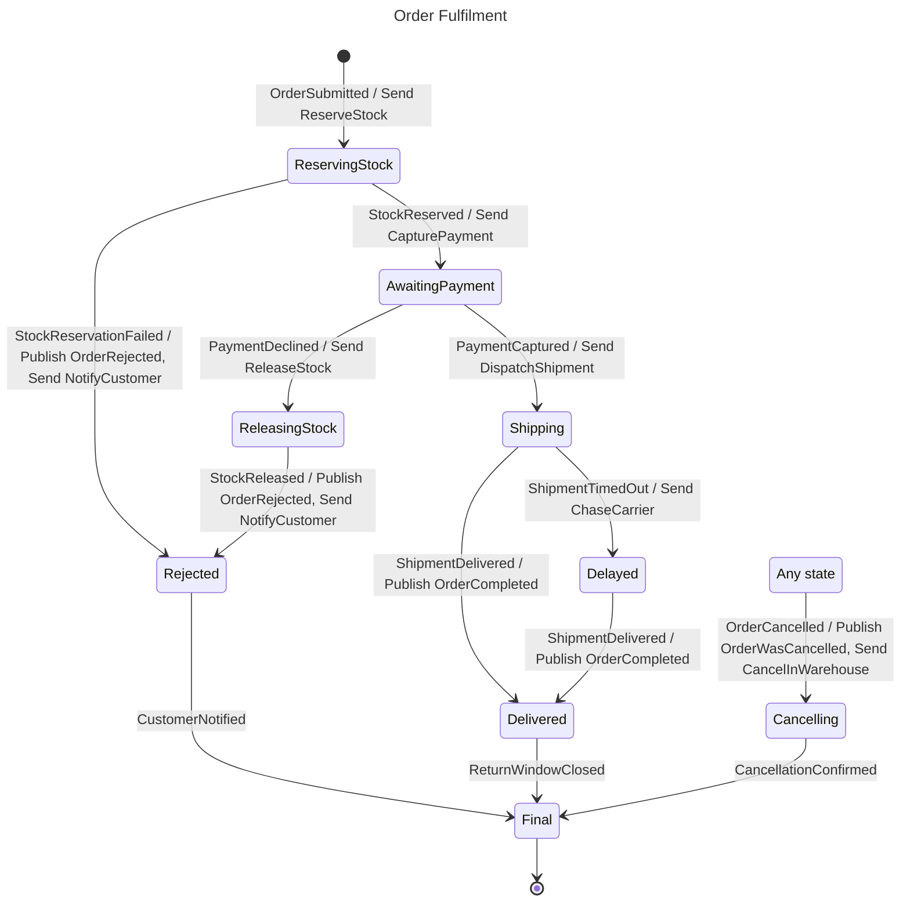

# Order Fulfilment

## Diagram

## States

| State | Type | Description | Activities | Compensation | Retry | Timeout |
| --- | --- | --- | --- | --- | --- | --- |
| Initial | Initial |  |  |  |  |  |
| ReservingStock | Decision |  | Send ReserveStock |  |  |  |
| AwaitingPayment | Decision |  | Send CapturePayment |  |  |  |
| ReleasingStock | State |  | Send ReleaseStock |  |  |  |
| Rejected | State |  | Publish OrderRejected Send NotifyCustomer |  |  |  |
| Shipping | Decision |  | Send DispatchShipment |  |  |  |
| Delayed | State |  | Send ChaseCarrier |  |  |  |
| Delivered | State |  | Publish OrderCompleted |  |  |  |
| Cancelling | State |  | Publish OrderWasCancelled Send CancelInWarehouse |  |  |  |
| Final | Final |  |  |  |  |  |
| Any state | Any state |  |  |  |  |  |

## Transitions

| From | Event | Source | To | Kind |
| --- | --- | --- | --- | --- |
| Initial | OrderSubmitted | external | ReservingStock | Forward |
| ReservingStock | StockReserved | external | AwaitingPayment | Forward |
| ReservingStock | StockReservationFailed | external | Rejected | Forward |
| AwaitingPayment | PaymentCaptured | external | Shipping | Forward |
| AwaitingPayment | PaymentDeclined | external | ReleasingStock | Forward |
| ReleasingStock | StockReleased | external | Rejected | Forward |
| Rejected | CustomerNotified | external | Final | Forward |
| Shipping | ShipmentDelivered | external | Delivered | Forward |
| Shipping | ShipmentTimedOut | external | Delayed | Forward |
| Delayed | ShipmentDelivered | external | Delivered | Forward |
| Delivered | ReturnWindowClosed | external | Final | Forward |
| Cancelling | CancellationConfirmed | external | Final | Forward |
| Any state | OrderCancelled | external | Cancelling | Forward |

## Commands

| Command | Sent in |
| --- | --- |
| CancelInWarehouse | Cancelling |
| CapturePayment | AwaitingPayment |
| ChaseCarrier | Delayed |
| DispatchShipment | Shipping |
| NotifyCustomer | Rejected |
| ReleaseStock | ReleasingStock |
| ReserveStock | ReservingStock |

## Events

| Event | Origin | Published in | Triggers |
| --- | --- | --- | --- |
| CancellationConfirmed | External |  | Cancelling → Final |
| CustomerNotified | External |  | Rejected → Final |
| OrderCancelled | External |  | Any state → Cancelling |
| OrderCompleted | Internal | Delivered |  |
| OrderRejected | Internal | Rejected |  |
| OrderSubmitted | External |  | Initial → ReservingStock |
| OrderWasCancelled | Internal | Cancelling |  |
| PaymentCaptured | External |  | AwaitingPayment → Shipping |
| PaymentDeclined | External |  | AwaitingPayment → ReleasingStock |
| ReturnWindowClosed | External |  | Delivered → Final |
| ShipmentDelivered | External |  | Shipping → Delivered Delayed → Delivered |
| ShipmentTimedOut | External |  | Shipping → Delayed |
| StockReleased | External |  | ReleasingStock → Rejected |
| StockReservationFailed | External |  | ReservingStock → Rejected |
| StockReserved | External |  | ReservingStock → AwaitingPayment |
