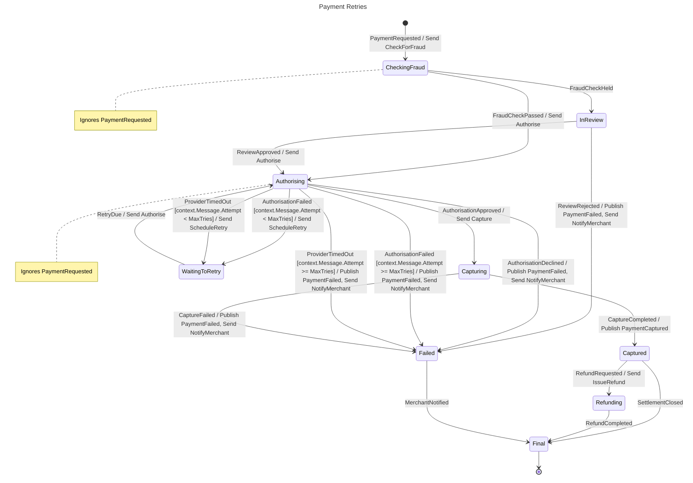

# Payment Retries

## Diagram

## States

| State | Type | Description | Activities | Ignores | Compensation | Retry | Timeout |
| --- | --- | --- | --- | --- | --- | --- | --- |
| Initial | Initial |  |  |  |  |  |  |
| CheckingFraud | Decision |  | Send CheckForFraud | PaymentRequested |  |  |  |
| InReview | Decision |  |  |  |  |  |  |
| Authorising | Decision |  | Send Authorise | PaymentRequested |  |  |  |
| WaitingToRetry | State |  | Send ScheduleRetry |  |  |  |  |
| Capturing | Decision |  | Send Capture |  |  |  |  |
| Captured | Decision |  | Publish PaymentCaptured |  |  |  |  |
| Refunding | State |  | Send IssueRefund |  |  |  |  |
| Failed | State |  | Publish PaymentFailed Send NotifyMerchant |  |  |  |  |
| Final | Final |  |  |  |  |  |  |

## Transitions

| From | Event | Guard | Source | To | Kind |
| --- | --- | --- | --- | --- | --- |
| Initial | PaymentRequested |  | external | CheckingFraud | Forward |
| CheckingFraud | FraudCheckPassed |  | external | Authorising | Forward |
| CheckingFraud | FraudCheckHeld |  | external | InReview | Forward |
| InReview | ReviewApproved |  | external | Authorising | Forward |
| InReview | ReviewRejected |  | external | Failed | Forward |
| Authorising | AuthorisationApproved |  | external | Capturing | Forward |
| Authorising | AuthorisationDeclined |  | external | Failed | Forward |
| Authorising | AuthorisationFailed | context.Message.Attempt < MaxTries | external | WaitingToRetry | Forward |
| Authorising | AuthorisationFailed | context.Message.Attempt >= MaxTries | external | Failed | Forward |
| Authorising | ProviderTimedOut | context.Message.Attempt < MaxTries | external | WaitingToRetry | Forward |
| Authorising | ProviderTimedOut | context.Message.Attempt >= MaxTries | external | Failed | Forward |
| WaitingToRetry | RetryDue |  | external | Authorising | Forward |
| Capturing | CaptureCompleted |  | external | Captured | Forward |
| Capturing | CaptureFailed |  | external | Failed | Forward |
| Captured | RefundRequested |  | external | Refunding | Forward |
| Captured | SettlementClosed |  | external | Final | Forward |
| Refunding | RefundCompleted |  | external | Final | Forward |
| Failed | MerchantNotified |  | external | Final | Forward |

## Commands

| Command | Sent in |
| --- | --- |
| Authorise | Authorising |
| Capture | Capturing |
| CheckForFraud | CheckingFraud |
| IssueRefund | Refunding |
| NotifyMerchant | Failed |
| ScheduleRetry | WaitingToRetry |

## Events

| Event | Origin | Published in | Triggers |
| --- | --- | --- | --- |
| AuthorisationApproved | External |  | Authorising → Capturing |
| AuthorisationDeclined | External |  | Authorising → Failed |
| AuthorisationFailed | External |  | Authorising → WaitingToRetry Authorising → Failed |
| CaptureCompleted | External |  | Capturing → Captured |
| CaptureFailed | External |  | Capturing → Failed |
| FraudCheckHeld | External |  | CheckingFraud → InReview |
| FraudCheckPassed | External |  | CheckingFraud → Authorising |
| MerchantNotified | External |  | Failed → Final |
| PaymentCaptured | Internal | Captured |  |
| PaymentFailed | Internal | Failed |  |
| PaymentRequested | External |  | Initial → CheckingFraud |
| ProviderTimedOut | External |  | Authorising → WaitingToRetry Authorising → Failed |
| RefundCompleted | External |  | Refunding → Final |
| RefundRequested | External |  | Captured → Refunding |
| RetryDue | External |  | WaitingToRetry → Authorising |
| ReviewApproved | External |  | InReview → Authorising |
| ReviewRejected | External |  | InReview → Failed |
| SettlementClosed | External |  | Captured → Final |
