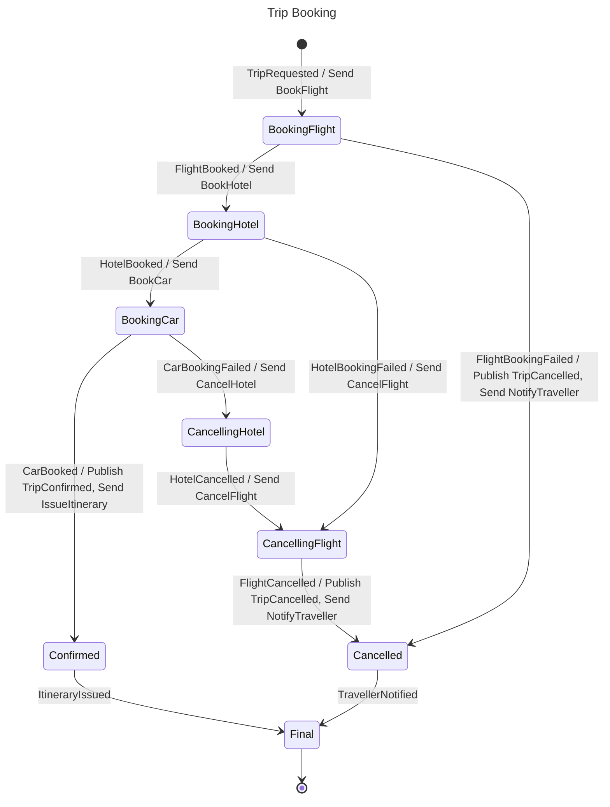

# Trip Booking

## Diagram

## States

| State | Type | Description | Activities | Compensation | Retry | Timeout |
| --- | --- | --- | --- | --- | --- | --- |
| Initial | Initial |  |  |  |  |  |
| BookingFlight | Decision |  | Send BookFlight |  |  |  |
| BookingHotel | Decision |  | Send BookHotel |  |  |  |
| BookingCar | Decision |  | Send BookCar |  |  |  |
| Confirmed | State |  | Publish TripConfirmed Send IssueItinerary |  |  |  |
| CancellingHotel | State |  | Send CancelHotel |  |  |  |
| CancellingFlight | State |  | Send CancelFlight |  |  |  |
| Cancelled | State |  | Publish TripCancelled Send NotifyTraveller |  |  |  |
| Final | Final |  |  |  |  |  |

## Transitions

| From | Event | Source | To | Kind |
| --- | --- | --- | --- | --- |
| Initial | TripRequested | external | BookingFlight | Forward |
| BookingFlight | FlightBooked | external | BookingHotel | Forward |
| BookingFlight | FlightBookingFailed | external | Cancelled | Forward |
| BookingHotel | HotelBooked | external | BookingCar | Forward |
| BookingHotel | HotelBookingFailed | external | CancellingFlight | Forward |
| BookingCar | CarBooked | external | Confirmed | Forward |
| BookingCar | CarBookingFailed | external | CancellingHotel | Forward |
| CancellingHotel | HotelCancelled | external | CancellingFlight | Forward |
| CancellingFlight | FlightCancelled | external | Cancelled | Forward |
| Confirmed | ItineraryIssued | external | Final | Forward |
| Cancelled | TravellerNotified | external | Final | Forward |

## Commands

| Command | Sent in |
| --- | --- |
| BookCar | BookingCar |
| BookFlight | BookingFlight |
| BookHotel | BookingHotel |
| CancelFlight | CancellingFlight |
| CancelHotel | CancellingHotel |
| IssueItinerary | Confirmed |
| NotifyTraveller | Cancelled |

## Events

| Event | Origin | Published in | Triggers |
| --- | --- | --- | --- |
| CarBooked | External |  | BookingCar → Confirmed |
| CarBookingFailed | External |  | BookingCar → CancellingHotel |
| FlightBooked | External |  | BookingFlight → BookingHotel |
| FlightBookingFailed | External |  | BookingFlight → Cancelled |
| FlightCancelled | External |  | CancellingFlight → Cancelled |
| HotelBooked | External |  | BookingHotel → BookingCar |
| HotelBookingFailed | External |  | BookingHotel → CancellingFlight |
| HotelCancelled | External |  | CancellingHotel → CancellingFlight |
| ItineraryIssued | External |  | Confirmed → Final |
| TravellerNotified | External |  | Cancelled → Final |
| TripCancelled | Internal | Cancelled |  |
| TripConfirmed | Internal | Confirmed |  |
| TripRequested | External |  | Initial → BookingFlight |
